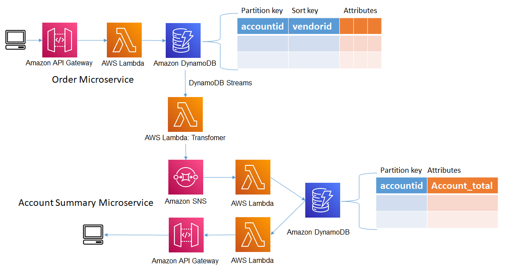
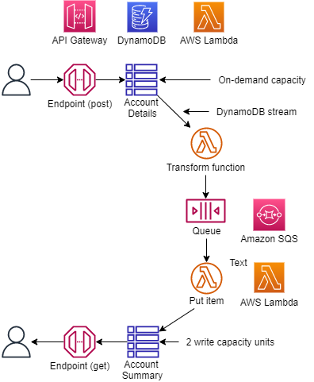

## Introducing the CQRS Pattern
This is an example of a CQRS (command query response segregation) microservice pattern. This example also demonstrates using API Gateway mapping templates to directly update a DynamoDB table without invoking a Lambda function.

CQRS is a Command Query Response Segregation pattern. This pattern separates read operations from update operations. The pattern is often used when read and update operations use different data modelsy. For example, the Account Details DynamoDB table would record each account transaction, while the Account Summary DynamoDB table would record a summary of transactions for each account.

By using a CQRS pattern you would extract the records from the Account Details table, aggregate the records and write the records to the Account Summary table. An endpoint would be created for POST operation to account details while another endpoint would be used for GET operations on the account summary.

## The Scaling Challenge

Pattern 1 uses a DynamoDB stream to invoke a Lambda function that aggregates account detail records, transforming the records into an account summary. The transformation function writes directly to the Account Summary DynamoDB tables. This approach reduces latency; however, it does introduce a potential scaling problem. If the Account Detail DynamoDB table is configured to scale to a higher capacity, this will result in the DynamoDB stream scaling along with lambda function. If the Account Summary table is not configured to scale, the transformation function will start to timeout and return errors.



## The solution
Pattern 2 introduces an Amazon SQS queue. This will allow each service to scale independently, therefore the Account Summary table does not need to scale along with the Account Details table to meet the capacity demand.



## Setup

You will need to download and install [Node.js](https://nodejs.org/en/download/) before you can start using the AWS Cloud Development Kit.


This example is developed using the AWS CDK and Typescript, so you will need to install both Typescript and the CDK using the following commands
```
npm install -g typescript
npm install -g aws-cdk@latest
```
Since this CDK project uses ['Assests'](https://docs.aws.amazon.com/cdk/latest/guide/assets.html), you might need to run the following command to provision resources the AWS CDK will need to perform the deployment.

```bash 
cdk bootstrap
```

The testing scripts can be executed using Jupyter Notebook. There are a few methods for installing Jupyter Notebooks. These instructions will help you get to started with [JupyterLab](https://jupyter.org/install) installation. 

You can also install Jupyter Notebooks as part of [Anaconda](https://docs.anaconda.com/anaconda/install/index.html) installation.

To download this example, you will need to install [Git](https://github.com/git-guides/install-git). After installing git follow these [instructions](https://github.com/git-guides/git-clone) to learn how to clone the repository.

After the repository has been cloned set the command prompt path to the cloned directory and run the following command to install the project dependencies.

```bash
npm install
```

**cdk synth** executes the application which translates the Typescript code into an AWS CloudFormation template.

```bash
cdk synth
```

After the synth command has generated the template use the  **cdk deploy** command to deploy the template to AWS CloudFormation and build the stack. You will be prompted to confirm the deployment with y/n.

```bash
cdk deploy --all
```

## Run the Example
Open the Jupyter Notebook in the **jupyter_notebook directory** follow the instructions.


## Cleanup
From the command prompt execute the following command: **cdk destroy**
