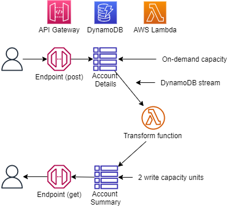

## Example
Command Query Response Segregation (CQRS), is a pattern used in microservice architecture when multiple microservices require access to the same data but each microservice requires the data to be available in a differant shape. 

The first microservice in this example generates an order. The second microservice produces an account summary by aggregating the total of each order filtered by accountpid. The final micrsoservice stores the account summary in an Amazon DynamoDB table and makes it available through the API Gateway.



## Setup

1. The following prerequisities are required for this example
  
```bash
npm install -g typescript
npm install -g aws-cdk
```
Install Jupyter Notebook following instructions on this ['site'](https://jupyter.org/install).

2. Since this CDK project uses ['Assests'](https://docs.aws.amazon.com/cdk/latest/guide/assets.html), you might need to run the following command to provision resources the AWS CDK will need to perform the deployment.

```bash 
cdk bootstrap
```

2. Install the dependencies

```bash
npm install
```

3. Execute **cdk synth** to synthesize as AWS CloudFormation template

```bash
cdk synth
```

4. Execute **cdk deploy** to deploy the template and build the stack

```bash
cdk deploy
```

1. Open the Jupyter Notebook in the **jupyter notebook directory** follow the instructions